# PANW AI Red Teaming — Docker Client

One-command Docker Compose install for the Palo Alto Networks AI Red Teaming network client. No Kubernetes, no Helm.



## Install

```bash
git clone https://github.com/PaloAltoNetworks/ai-redteam-network-client-docker.git
cd ai-redteam-network-client-docker
chmod +x setup-panw-network-client.sh
./setup-panw-network-client.sh
```

Prompts for **region**, **Client ID**, **Client Secret**. Everything else auto-discovered from the API (TSG ID, registry credentials, image version, channel).

## Verify

```bash
./setup-panw-network-client.sh --validate
```

Expect `Connected to the server` in the logs, or see **Validate Channel** in the portal.

## Why

Palo Alto's portal only ships Kubernetes/Helm instructions. This runs on any server with Docker (EC2, VM, bare metal) in three commands.

The script:
1. Authenticates via OAuth2, auto-discovers channels, registry creds, and image.
2. Pulls the image via Docker.
3. Generates a hardened `docker-compose.yml` (read-only FS, dropped caps, resource limits, healthcheck).

## Security highlights

- Read-only filesystem, all capabilities dropped, no privilege escalation
- Memory / CPU / PID limits
- Credentials never visible in `ps` (`--header @file` pattern)
- `.env` files at `chmod 600`, `.gitignore` pre-configured
- Image digest logged to `deploy.log` for SOC 2 / ISO 27001

## Docs

- **[Reference](docs/reference.md)** — CLI modes, tunables, overrides, operations, K8s migration
- **[Troubleshooting](docs/reference.md#troubleshooting)** — or run `./setup-panw-network-client.sh --diagnose`

## License

See [LICENSE](LICENSE).
